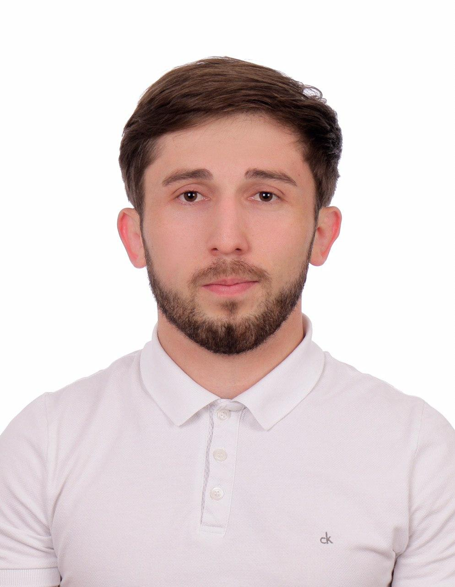

    

Привет! Меня зовут Альберт Черткоев, я back-end разработчик с более чем 10-летним опытом работы в сфере .NET-разработки. 
С 2013 года я профессионально занимаюсь разработкой на платформе Microsoft .NET.
Фокусируюсь на архитектуре и проектировании распределенных систем, реализованных с помощью ASP.NET Core, которые могут работать как в облаке, так и локально, а также на внутренних механизмах .NET, таких как Управление памятью / Сборка мусора, многопоточность, асинхронное программирование и производительность.

## Образование

Высшее образование

Северо-Кавказский горно-металлургический институт (СКГМИ)

<ul>
<li>Период обучения: 2010 - 2014</li>
<li>Факультет: Информационных технологий</li>
<li>Направление: Автоматизированные системы управления (АСУ)</li>
<li>Квалификация: Бакалавр</li>
<li>Тема дипломной работы: "Разработка программного обеспечения для автоматизации составления расписания занятий в высших учебных заведениях"</li>
</ul>
